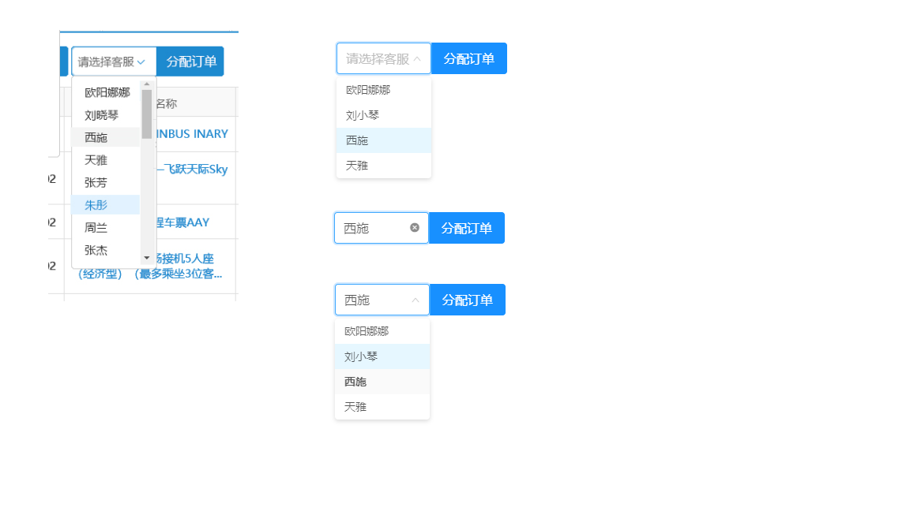
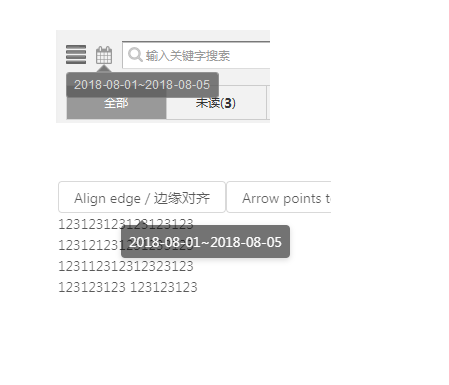
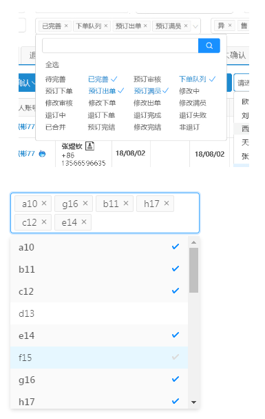

######issue

1.分配订单

[demo](https://codesandbox.io/s/m4mkqykrx)

与原设计 UI 上有细微差异但能满足功能并拓展了设计稿上没有的功能。

2.表单部分

部分输入框和选择框没有 label（？节约空间，placeholder 中有标题信息）

当在输入框中输入值后，placeholder 会消失，会给使用者造成作用不明的疑惑。

3.消息模块

选择日期后显示的 tooltip 效果参考

[demo](https://codesandbox.io/s/w7zyvx4p8l)

4.多选 tag

最优处理 or 标准处理

[demo](https://codesandbox.io/s/o5kx47y426)
